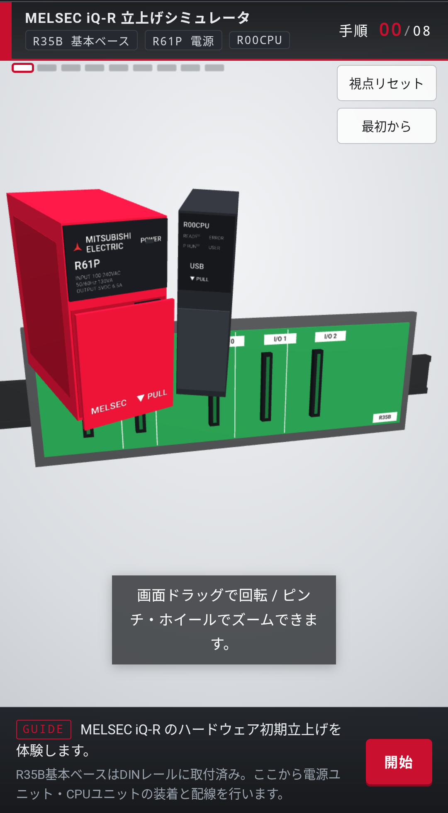
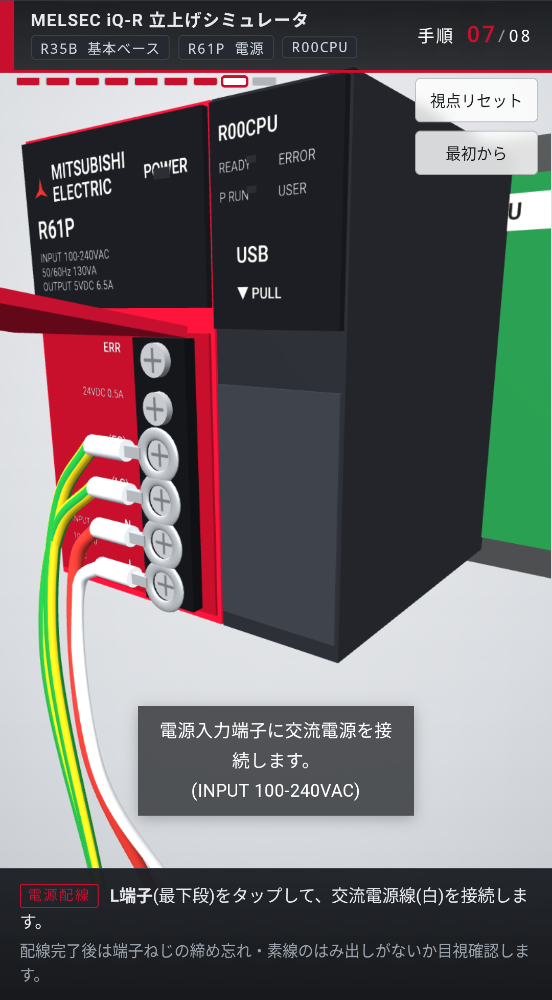
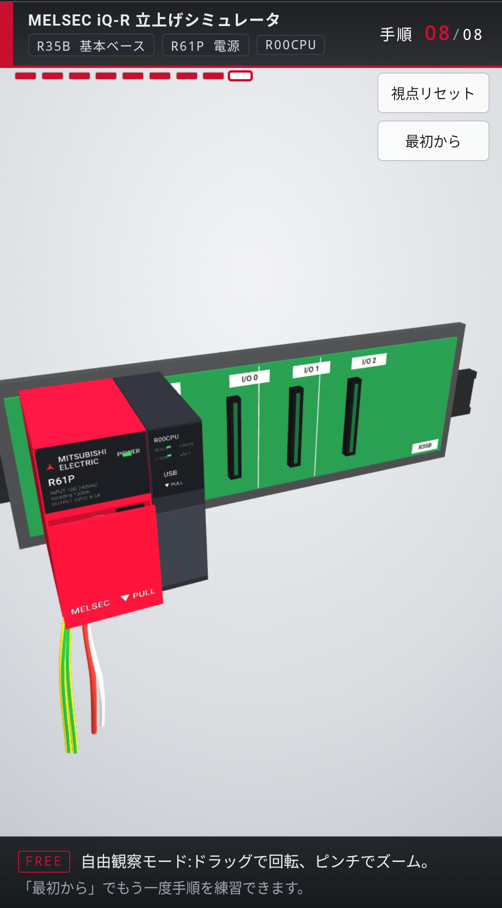

# MELSEC iQ-R 立上げシミュレータ

*An interactive 3D trainer for the hardware startup of a Mitsubishi MELSEC iQ-R PLC — runs entirely in the browser.*

三菱電機 MELSEC iQ-R シリーズ（R33B 基本ベース／R61P 電源ユニット／R00CPU）の**ハードウェア初期立上げ**を、ブラウザ上の 3D 操作で学べる学習用シミュレータです。ユニットのベースへの装着、端子カバーの開閉、丸形圧着端子による接地・電源配線、電源投入と LED 確認までを、実機の手順に沿って一連で体験できます。

## スクリーンショット

| 開始画面 | 電源・接地配線（手順07） | 立上げ完了・自由観察（手順08） |
|:---:|:---:|:---:|
|  |  |  |

## 特徴

- **8 ステップの手順ガイド** — 概要 → 電源ユニット装着 → CPU 装着 → 端子カバー開 → FG／LG 接地 → N／L 電源配線 → 電源投入まで、字幕とマーカーで一手ずつ誘導します。
- **実機に寄せた 3D モデル** — R61P 電源ユニット（黒ヘッダ、端子台6ねじ、上ヒンジの ▼PULL カバー）、R00CPU（READY／ERROR／P RUN 表示）、R33B ベース（DIN レール、スロット、緑基板）を再現。
- **配線** — 丸形圧着端子（リング＋絶縁バレル）、緑／黄の接地線、電源線。端子カバーを閉じると配線がカバー裏に収まります。
- **タッチ操作** — ドラッグで回転、ピンチ／ホイールでズーム。スマートフォンの縦画面でも見切れないよう視野角を自動調整します。
- **完了後の自由観察モード** — 立上げ後は装置全体を自由に見回せます。「最初から」で何度でも練習できます。

## 操作方法

- **視点** — 画面をドラッグで回転、ピンチ／マウスホイールでズーム。
- **手順を進める** — 画面内の赤いマーカーが示す対象（ユニット・カバー・端子ねじ）をタップ／クリックします。
- **視点リセット** — 俯瞰の初期視点に戻ります。
- **最初から** — 手順を最初からやり直します。

## 学習できる手順

| 手順 | 内容 |
|:---:|:---|
| 00 | 概要（操作説明） |
| 01 | 電源ユニット **R61P** を POWER スロットへ装着 |
| 02 | **R00CPU** を CPU スロットへ装着 |
| 03 | 端子カバー（▼PULL）を開く |
| 04 | **FG** 端子へ接地線を接続 |
| 05 | **LG** 端子へ接地線を接続（LG–FG 短絡・接地の注意表示） |
| 06 | **N** 端子へ電源線を接続 |
| 07 | **L** 端子へ電源線を接続 → カバーを閉じる |
| 08 | 電源投入 → POWER LED／READY LED の点灯確認 → 完了 |

## 動作環境

- WebGL 対応のモダンブラウザ（Chrome / Edge / Safari / Firefox の最新版）
- PC・スマートフォン・タブレットいずれも可
- 3D ライブラリ [three.js](https://threejs.org/) r128 を CDN（cdnjs）から読み込みます。

## ⚠️ 免責・注意事項

- 本シミュレータは**学習・体験を目的とした教材**です。形状・寸法・端子配列・配線色などは理解しやすさを優先して簡略化・脚色しており、実機と厳密には一致しません。
- 電線の色は参考にした立上げ手順の映像表現に合わせています。**実際の配線色・極性・接地方式は、ご使用の電源仕様および各国／各社の配線規程・法令に必ず従ってください。**
- 実機の据付・配線・接地・活線作業には感電などの危険が伴います。**必ずメーカの取扱説明書・ユーザーズマニュアルおよび有資格者の指示に従って**作業してください。本シミュレータの内容を実機作業の根拠として用いないでください。
- 本ソフトウェアは現状有姿で提供され、利用によって生じたいかなる損害についても作者は責任を負いません。

## 商標

MELSEC、iQ-R、GX Works3 は三菱電機株式会社の商標または登録商標です。本プロジェクトは非公式の学習用作品であり、三菱電機株式会社およびその関連会社とは一切関係ありません。

## ライセンス

[MIT License](LICENSE) © mokouliszt

## 作者

**mokouliszt**

- GitHub: [@mokouliszt](https://github.com/mokouliszt)
- Ko-fi: [ko-fi.com/mokouliszt](https://ko-fi.com/mokouliszt)

役に立ったら ⭐ を付けていただけると励みになります。
